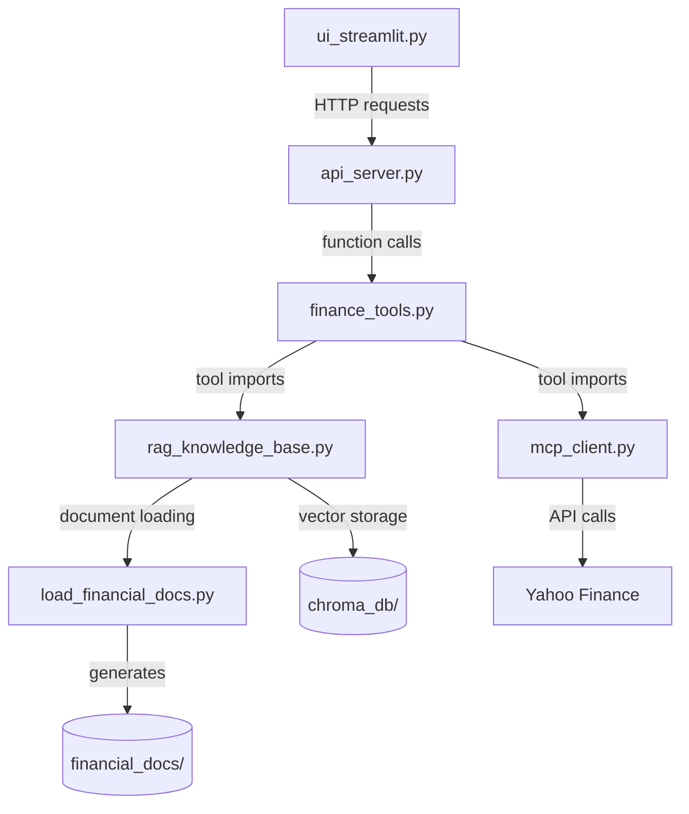

# 🤖 FinGuard AI - Intelligent Financial Assistant

<p align="center">
  
  
  
  
  
  
</p>

<p align="center">
  <b>FinGuard AI</b> is an intelligent financial assistant that combines real-time financial data (Yahoo Finance) with synthetic document analysis through RAG (Retrieval-Augmented Generation).
</p>

---


## 📋 Table of Contents
- [API Demonstration](#-api-demonstration)
- [Project Overview](#-project-overview)
- [Architecture & Workflow](#-architecture--workflow)
- [Features](#-features)
- [Technology Stack](#-technology-stack)
- [Project Structure](#-project-structure)
- [Installation & Setup](#-installation--setup)
- [Contributing](#-contributing)
- [License](#-license)


## 📡 API Demonstration


---

---

## 🔍 Project Overview

**FinGuard AI** is a hybrid financial assistant capable of working with two types of data:

1. **Real Companies** - retrieving up-to-date financial data via Yahoo Finance API (stock prices, company information, historical data, financial ratios)

2. **Synthetic/Fictional Companies** - analyzing financial documents through RAG (Retrieval-Augmented Generation) using ChromaDB vector database

The project demonstrates the capabilities of modern AI agents in the financial domain and serves as a testing platform for various approaches to financial information processing.

---

## 🏗 Architecture & Workflow


### 📋 Detailed Interaction Flow

| Step | From | To | Action | Data Format |
|------|------|----|--------|-------------|
| **1** | **User** | **Streamlit UI** | Query entered in chat interface | `string` (natural language) |
| **2** | **Streamlit** | **FastAPI Server** | HTTP POST request to `/agent/run` | `JSON: {"text": "query", "session_id": "uuid"}` |
| **3** | **FastAPI** | **Agent** | `run_agent()` function call | `(query: str, session_id: str) → str` |
| **4** | **Agent** | **LangGraph** | Create messages array and invoke agent | `{"messages": [{"role": "user", "content": query}]}` |
| **5** | **LangGraph** | **Ollama LLM** | Pass prompt to LLM for analysis | LangChain message format |
| **6** | **Ollama** | **LangGraph** | Return tool decision | ReAct format with Action/Action Input |
| **7** | **LangGraph** | **Tools** | Execute selected tool | Function call with parameters |
| **8** | **MCP Tools** | **Yahoo Finance** | Fetch real-time financial data | REST API call via `yfinance` |
| **9** | **RAG Tools** | **ChromaDB** | Semantic search in vector DB | `similarity_search_with_score()` |
| **10** | **Tools** | **LangGraph** | Return observation data | Formatted string with results |
| **11** | **LangGraph** | **Ollama LLM** | Send observation for final response | Observation + conversation history |
| **12** | **Ollama** | **LangGraph** | Generate natural language answer | `string` (final response) |
| **13** | **LangGraph** | **Agent** | Extract and process response | `AIMessage` object |
| **14** | **Agent** | **FastAPI** | Clean response with `safe_str()` | `string` (sanitized UTF-8) |
| **15** | **FastAPI** | **Streamlit** | Return JSON response | `{"response": "answer", "session_id": "uuid", "tools_used": [...]}` |
| **16** | **Streamlit** | **User** | Display message in chat | Rendered markdown in UI |

---

## ✨ Features

### 📊 Real Companies (Yahoo Finance)
- ✅ **Real-time stock prices** - current quotes retrieval
- ✅ **Company information** - profile, sector, industry, business description
- ✅ **Historical data** - prices for periods (1d, 5d, 1mo, 3mo, 6mo, 1y)
- ✅ **Financial ratios** - P/E, P/B, ROE, margins, and more

### 📚 Fictional Companies (RAG)
- ✅ **Document search** - semantic search in financial reports
- ✅ **30+ synthetic companies** - across various economic sectors
- ✅ **Quarterly and annual reports** - detailed financial information
- ✅ **Industry analysis reports** - macroeconomic insights
- ✅ **Company comparisons** - analysis across different metrics

### 🧠 AI Capabilities
- ✅ **ReAct agent** - action planning and execution
- ✅ **Local LLM** - Ollama with llama3.1:8b model
- ✅ **Context awareness** - conversation history tracking
- ✅ **Multi-tool orchestration** - combining different data sources

### 🖥️ User Interface
- ✅ **Chat interface** - intuitive conversation
- ✅ **Session history** - context preservation
- ✅ **Query examples** - quick start for new users
- ✅ **Tool visibility** - transparency about used tools
- ✅ **Sidebar** - information about available companies

---

## 🛠 Technology Stack

### Backend
| Technology | Version | Purpose |
|------------|---------|---------|
| Python | 3.11 | Core programming language |
| FastAPI | 0.104 | REST API server |
| Uvicorn | 0.24 | ASGI server |
| LangChain | 0.2 | AI agent framework |
| LangGraph | 0.2 | Agent orchestration |
| Pydantic | 2.4 | Data validation |

### Frontend
| Technology | Version | Purpose |
|------------|---------|---------|
| Streamlit | 1.28 | Web interface |
| Requests | 2.31 | HTTP client |

### Machine Learning & RAG
| Technology | Version | Purpose |
|------------|---------|---------|
| Ollama | latest | Local LLM server |
| llama3.1:8b | 8B | Language model |
| ChromaDB | 0.4 | Vector database |
| Sentence-Transformers | 2.2 | Embedding model |
| Transformers | 4.36 | Transformers library |
| PyTorch | 2.1 | Deep learning framework |

### Financial Data
| Technology | Version | Purpose |
|------------|---------|---------|
| yfinance | 0.2 | Yahoo Finance API |
| pandas | 2.2 | Data analysis |
| numpy | 1.26 | Numerical computing |

### Document Processing
| Technology | Version | Purpose |
|------------|---------|---------|
| PyPDF | 4.0 | PDF file reading |
| PyPDF2 | 3.0 | Alternative PDF parser |

---


## 📌 Project Structure

| File | Description |
|------|-------------|
| `api_server.py` | FastAPI server handling HTTP requests from Streamlit UI to agent. Runs on port 8000. |
| `ui_streamlit.py` | Streamlit-based chat interface with sidebar for settings, session management, and query examples. Runs on port 8501. |
| `finance_tools.py` | Core LangGraph agent implementation containing all available tools (MCP for real companies, RAG for fictional companies). |
| `rag_knowledge_base.py` | RAG system implementation with HuggingFace embeddings, ChromaDB integration, and semantic search functionality. |
| `mcp_client.py` | MCP (Model Context Protocol) client for Yahoo Finance API providing real-time stock data, company info, and financial ratios. |
| `load_financial_docs.py` | Utility script that generates 30+ synthetic financial documents and loads them into ChromaDB vector store. |
| `__init__.py` | Makes the tools directory a Python package for proper imports. |

---

### 📂 Directory Details

#### **`tools/` - Core Application Directory**
Contains all Python modules that power the FinGuard AI assistant:
- **API Layer**: `api_server.py` - REST endpoints
- **UI Layer**: `ui_streamlit.py` - User interface
- **Agent Layer**: `finance_tools.py` - AI orchestration
- **Data Layer**: `rag_knowledge_base.py`, `mcp_client.py` - Data sources
- **Utilities**: `load_financial_docs.py` - Setup and maintenance

#### **`financial_docs/` - Document Storage**
Auto-generated directory containing:
- Quarterly and annual reports for 30+ fictional companies
- Industry analysis reports
- Macroeconomic outlook documents
- All files are in `.txt` format for easy processing

#### **`chroma_db/` - Vector Database**
Auto-created directory containing:
- ChromaDB SQLite database
- Indexed embeddings for all document chunks
- Persistent storage for semantic search

#### **Root Directory Files**
| File | Purpose |
|------|---------|
| `requirements.txt` | Complete list of Python dependencies with version specifications |
| `.env` | Environment variables for API keys and configuration (optional) |
| `.gitignore` | Git ignore rules for virtual environment, cache files, and local data |
| `README.md` | Project documentation, setup instructions, and usage guide |

---


---

## 📌 Installation & Setup

In order to launch a project, you need to:

1. Clone repository
```bash
git clone https://github.com/SamirAlZgul/Agent_FinGuard
```

2. Check your python version:
```bash
python --version
```
project was testing on Python 3.11.9


3. Create and activate virtual environment:
```bash
python -m venv venv
```
Activate it:
For Windows (Command Prompt)
```bash
venv\Scripts\activate
```
For macOS/Linux
```bash
source venv/bin/activate
```

4. Install ollama
For Windows (PowerShell as Administrator)
```bash
irm https://ollama.com/install.ps1 | iex
```
For macOS/Linux
```bash
curl -fsSL https://ollama.com/install.sh | sh
```

5. Pull ollama image of a model
```bash
ollama pull llama3.1:8b 
```

6. Checking if ollama is working in your browser
http://localhost:11434
You should see: "Ollama is running"

7. Loading documents if DB
```bash
cd tools
python load_financial_docs.py
```
You should see something like this: total_chunks: 92

8. Launch server in a new terminal
```bash
python api_server.py
```

9. Launch UI interface in a new terminal
```bash
streamlit run ui_streamlit.py
```

